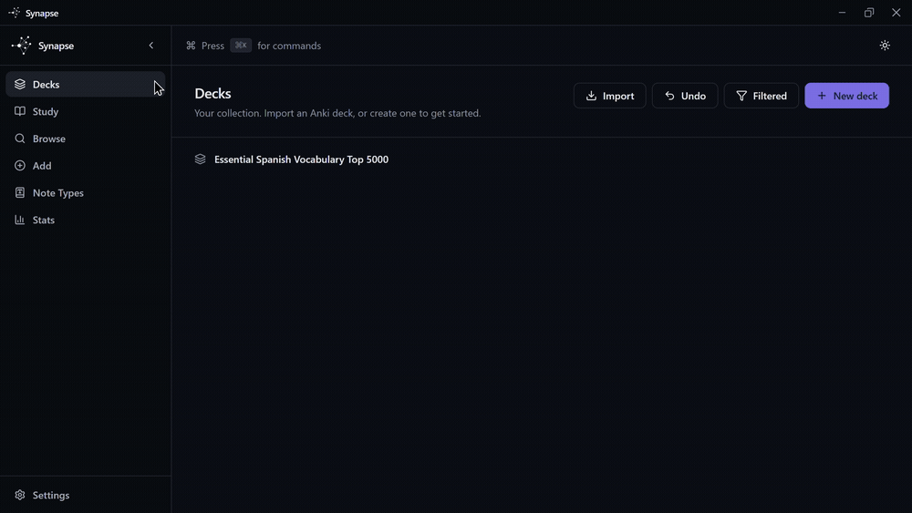

# Synapse

[](https://github.com/Emadab/Synapse/actions/workflows/ci.yml)
[](https://github.com/Emadab/Synapse/releases/latest)
[](LICENSE)

> A fast, modern spaced-repetition desktop app — fully compatible with Anki.

Anki's scheduling algorithm is excellent; its interface hasn't kept up. Synapse
wraps the same proven data model (and lets you move decks in and out of Anki
losslessly) in a native, keyboard-first desktop app that gets out of the way
during study.



## Features

- **100% Anki-compatible** import/export (`.apkg` v2/v3, `.colpkg`; schema v11 & v18)
- **SM-2 and FSRS** scheduling, switchable per deck
- **Offline-first**, native-feeling, keyboard-first
- **Sandboxed plugins** for extending the app without trusting arbitrary code
- **Tauri + React/TypeScript** shell over a UI-agnostic Rust core

## Install

Download the latest build for Windows, macOS, or Linux from the
[Releases page](https://github.com/Emadab/Synapse/releases/latest).

Already using Anki? Export your collection as a `.colpkg` (or a deck as
`.apkg`) from Anki's own **File → Export** menu, then import it into Synapse —
no conversion step, no data loss.

## Contributing

Bug reports, feature requests, and pull requests are welcome. Start with
[`CONTRIBUTING.md`](CONTRIBUTING.md) for setup, the dev workflow, and PR
expectations, and [`docs/ARCHITECTURE.md`](docs/ARCHITECTURE.md) for how the
codebase is laid out:

```
crates/        Rust core: core, db, scheduler, ankifmt, search, media, render, plugin
apps/desktop/  Tauri shell (src-tauri) + React frontend (src)
packages/      Shared TS: ipc-types (generated), ui-tokens, plugin-sdk
fixtures/      Real .apkg/.colpkg samples + golden scheduler vectors
docs/          Architecture & ADRs
```

## License

[MIT](LICENSE)

---

Synapse is an independent project and is not affiliated with, endorsed by, or
sponsored by Ankitects Pty Ltd. "Anki" is a trademark of Ankitects Pty Ltd.
